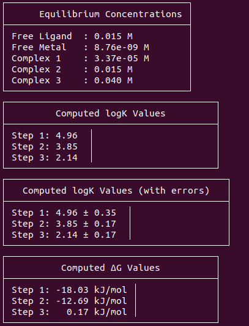

# Toolkit to extract physical quantities of metal-ligand simulations from Metadynamics free energy profiles 

This repository is strictly correlated with the work discussed in ... \
It is necessary to transform the $\Delta$ G measured through Metadynamics simulations into physical quantities comparable with experiments (pK) and viceversa as a check of one should expect in the free energy profile minima when starting from experimental quantities.

## Installation and environment
You can start using this repo right away using the yaml configuration file in the main directory doing \
`conda env create -f mle.yaml` \
`conda activate mle`
## Usage
This repo is still in development mode, so is not released as installable python package for now (pip install . will be available soon).\
To run correctly the analysis one should go to scripts, insert the values of logK or $\Delta$ G available either from litterature or experiments in the correct arrays, the number of metals and ligands in the system and also the volume of your simulated box. \
The script will take into account of denticity and print the equilibrium concentrations, constants and $\Delta$ G one should expect from Metadynamics coverged profiles if matches experiemntal pKs. It is possible to add $\Delta$ G uncertainties for computing logK with estimated errors.\
Finally just run\
`python metal-ligand-equil.py`

  
*Figure 1: Example of metal-ligand-equil.py output.*
## Reference
For a complete and detailed reference, please look at ...
## Contacts
For any suggestions or feature addition please contact luca.sagresti@sns.it
